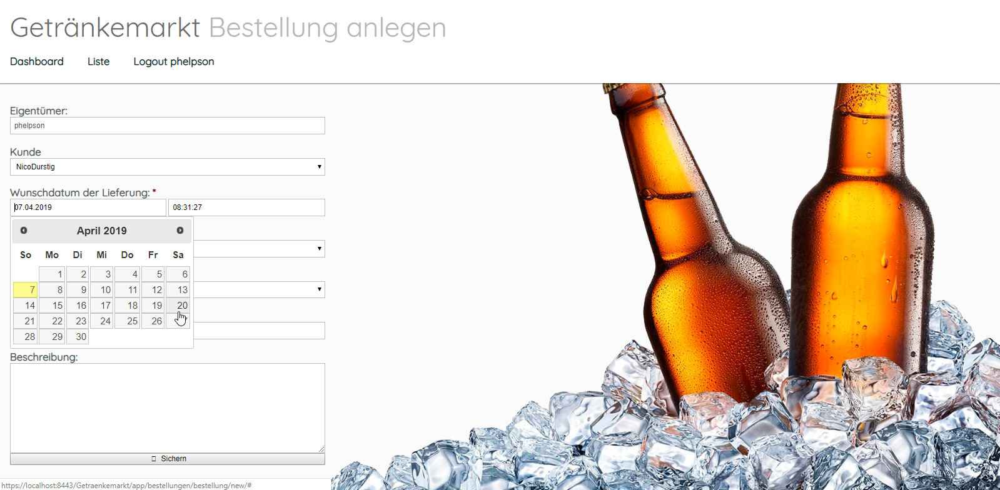

DHBW Projekt Getraenkemarktverwaltung
=========================

Kurzbeschreibung
----------------

Dies ist ein Projekt der DHBW Karlsruhe, um einen Getränkemarkt im Rahmen der Portfolioprüfung in Verteilte Systeme darzustellen.
Die Realisierung erfolgt vollständig in einer serverseitigen Java MVC-Webanwendung. 
Die Anwendung setzt dabei ganz klassisch auf der „Jakarta Enterprise Edition”
(ehemals „Java Enterprise Edition“) auf und läuft daher in einem speziell dafür
ausgelegten Applikationsserver. Sämtliche Anwendungslogik wird dabei vom Server
implementiert, so dass für jedes URL-Pattern der Anwendung ein komplett serverseitig
generierte HTML-Seite abgerufen und im Browser dargestellt wird.

Dazu ist eine Client App, die einen AJAX-Call per JavaScript startet. Dieser wird vom Server entgegengenommen und mittels der
implementierten REST-API verwertet.

Verwendete Technologien
-----------------------

Die App nutzt Maven als Build-Werkzeug und zur Paketverwaltung. Auf diese Weise
werden die für Jakarta EE notwendigen APIs, darüber hinaus aber keine weiteren
Abhängigkeiten, in das Projekt eingebunden. Der Quellcode der Anwendung ist dabei
wie folgt strukturiert:

 * **Servlets** dienen als Controller-Schicht und empfangen sämtliche HTTP-Anfragen.
 * **Enterprise Java Beans** dienen als Model-Schicht und kapseln die fachliche Anwendungslogik.
 * **Persistence Entities** modellieren das Datenmodell und werden für sämtliche Datenbankzugriffe genutzt.
 * **Java Server Pages** sowie verschiedene statische Dateien bilden die View und generieren den
   auf dem Bildschirm angezeigten HTML-Code.

Folgende Entwicklungswerkzeuge kommen dabei zum Einsatz:

 * [NetBeans:](https://netbeans.apache.org/) Integrierte Entwicklungsumgebung für Java und andere Sprachen
 * [Maven:](https://maven.apache.org/) Build-Werkzeug und Verwaltung von Abhängigkeiten
 * [Git:](https://git-scm.com/") Versionsverwaltung zur gemeinsamen Arbeit am Quellcode
 * [TomEE:](https://tomee.apache.org/) Applikationsserver zum lokalen Testen der Anwendung
 * [Derby:](https://db.apache.org/derby/) In Java implementierte SQL-Datenbank zum Testen der Anwendung
 
How-To: Client App Starten
-----------
Die Client App befindent sich im Git-Root Verzeichnis. Von dort aus, kann der gesamte Inhalt heruntergeladen werden.
Zum Ausführen ist es nur notwendig, entweder die bestelung_search.html oder die user_search.html Datei auszuführen.
Bitte stellen Sie dafür sichen, dass die Getränkemarkt-App deployed ist und eine Verbindung zur DerbyDB besteht.

Screenshots
-----------

<table style="max-width: 100%;">
    <tr>
        <td>
            
        </td>
        <td>
            
        </td>
    </tr>
    <tr>
        <td>
            Dashboard
        </td>
        <td>
            Bestellungen anzeigen
        </td>
    </tr>
</table>

<table style="max-width: 100%;">
    <tr>
        <td>
            
        </td>
        <td>
            
        </td>
    </tr>
    <tr>
        <td>
            Bestellung anlegen
        </td>
        <td>
            Client Application
        </td>
    </tr>
</table>

<table style="max-width: 100%;">
    <tr>
        <td>
            
        </td>
        <td>
            
        </td>
    </tr>
    <tr>
        <td>
            Client - Bestellung suchen
        </td>
        <td>
            Client - User suchen
        </td>
    </tr>
</table>

Copyright
---------
© 2019 Patrick Mahler, Luca Marmonti, Philip Mayer 
